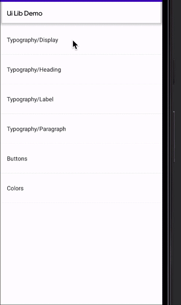

# OldKASE

OldKASE it's inspired on airbnb's [showcase](https://github.com/airbnb/Showkase) project, but designed to be used with Android's View/ViewGroup classes.



## How it works

Based on annotations it creates all the UI you need for exposing simple components, just return a `View`.

## Installation

Use next dependencies into your build.gradle
```groovy
implementation 'dev.cgomez:oldkase:0.0.2'
kapt 'dev.cgomez.oldkase:oldkase-processor:0.0.2'
```

## Example

On your roots package create a file with all your definitions.

```kotlin
@WidgetComponent("Button")
fun buttons(
  parent: ViewGroup,
  activity: FragmentActivity
): View {
  val button = Button(activity)
  button.text = "Hello World"
  return button
}
```

This will create a fragment called `ButtonFragment`, that you can expose in a MainActivity.

For you to easily integrate this into a Recycler View, you can use the generated function `allOptions()`, which has a relationship of all your generated Fragments.

# License

    Copyright 2021 Cristian Gomez

    Licensed under the Apache License, Version 2.0 (the "License");
    you may not use this file except in compliance with the License.
    You may obtain a copy of the License at

       http://www.apache.org/licenses/LICENSE-2.0

    Unless required by applicable law or agreed to in writing, software
    distributed under the License is distributed on an "AS IS" BASIS,
    WITHOUT WARRANTIES OR CONDITIONS OF ANY KIND, either express or implied.
    See the License for the specific language governing permissions and
    limitations under the License.
